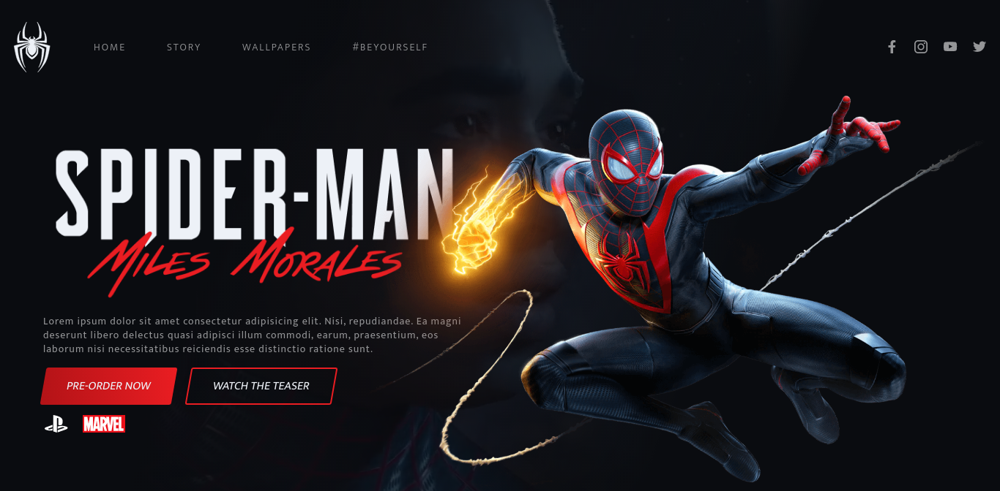

  

 

## 💻 Web

  
   

  
   

## 🛠 Tecnologias

Esse projeto foi desenvolvido com as seguintes tecnologias:
- HTML
- Sass
- Javascript
- SVGInject
- Tilt.js
- GSAP

## 📜 Projeto

Interface frontend inspirada no jogo Spider-man Miles Morales. Desenvolvida durante o FrontWeek.
